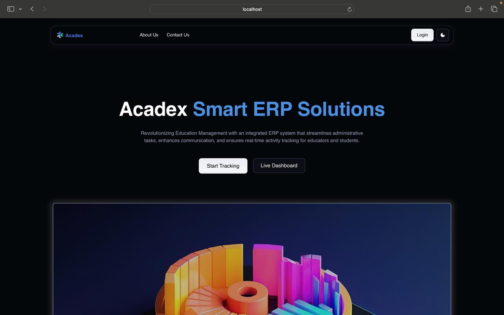

# Acadex - Educational ERP System

The Educational ERP System is a comprehensive platform designed to streamline the management of educational institutions by efficiently handling resources, finances, schedules, and student performance. This system integrates role-based smart dashboards, automated quiz generation, and resource sharing to enhance communication between educators and students.

### Key Features 
✅ ERP System – Manages institutional resources, finances, and schedules.   
✅ Role-Based Smart Dashboards – Provides insights, alerts, and email notifications for educators.  
✅ Resource Sharing – Enables easy sharing of educational materials like notes and quizzes.  
✅ Automated Quiz Generation & Result Sharing – Allows teachers to create quizzes dynamically, and students receive instant feedback upon submission.

### Technology Stack
Frontend: - [React](https://react.dev/)  
Backend: - [Node.js](https://nodejs.org/en), - [Express.js](https://expressjs.com/)  
Database: - [MongoDB](https://www.mongodb.com/)  
AI Integration: -[Google Gemini API](https://aistudio.google.com/prompts/new_chat?gad_source=1&gclid=Cj0KCQiA_Yq-BhC9ARIsAA6fbAj49YRwg5jFnOu5w7ohu3PbUBoWTHvdjBd2NAV6RwJQh4Zlli3IlpMaAnLEEALw_wcB)  
Authentication: -[JWT for secure login](https://jwt.io/)

### Getting Started

Acadex is deployed on a cloud platform, so you don’t need to set up the project locally. Follow the steps below to access and explore the system with ease.

#### Prerequisites
- **Web Browser:** Google Chrome, Firefox, Edge, etc.  
- **Internet Connection**  
- **Access Credentials:** Provided by your institution

#### Step 1: Access the Web Application
1. **Launch the Application:**  
   Open your preferred web browser and navigate to the live application URL. The homepage loads with a modern, intuitive interface.
   

2. **Login / Signup:**  
   - **Admins:** Log in to manage users, view detailed profiles, add or remove students/teachers, and send notifications.  
   - **Teachers:** Sign up to create and manage quizzes, share resources, and receive notifications.  
   - **Students:** Register to access courses, attempt quizzes, view scores, and receive alerts.  
   

---

#### Step 2: Explore Role-Specific Dashboards

1. **Admin Dashboard:**  
   - **User Management:**  
     View detailed profiles of students and teachers, add new users, or remove existing ones as needed.
   - **Notification Center:**  
     Compose and send messages to both students and teachers to ensure smooth communication.
   

2. **Teacher Dashboard:**  
   - **Courses Overview:**  
     View the list of courses assigned to you. Selecting a course opens a dedicated page with two options:
     - **Resources:** Upload educational materials by providing titles and Google Drive links.
     - **Quiz Generation:** Generate quizzes dynamically using the Gemini API. Simply input a quiz topic, and the system auto-generates a quiz with three multiple-choice questions (each having exactly four options and a designated correct answer). The generated quiz is then saved in the database with an accessible link.
   - **Notifications:**  
     Stay updated with messages and alerts regarding your courses and assignments.
   

3. **Student Dashboard:**  
   - **Course Navigation:**  
     View all enrolled courses along with recent notifications.
   - **Course Details:**  
     Upon selecting a course, switch between two tabs:
     - **Resources:** Access the course materials, complete with titles and drive links.
     - **Quizzes:** Click on quiz links to attempt assessments and receive immediate feedback.
   

---

#### Step 3: Utilize Core Functionalities

1. **For Admins:**  
   - **Monitoring and Management:**  
     Easily monitor detailed student and teacher profiles, manage user credentials, and remove or add users as needed.
   - **Broadcast Notifications:**  
     Send targeted or bulk notifications to keep the entire institution updated.
   

2. **For Teachers:**  
   - **Course Management:**  
     View and manage the courses assigned to you, ensuring timely delivery of content and assignments.
   - **Resource Upload:**  
     Seamlessly upload and share resources by entering a title and a Google Drive link.
   - **Automated Quiz Generation:**  
     Generate quizzes using the integrated Gemini API by simply providing a quiz topic. The system returns a fully formatted quiz (in JSON format) which is then stored for student access.
   

3. **For Students:**  
   - **Interactive Learning:**  
     Access course materials and quizzes effortlessly from your dashboard.
   - **Instant Feedback:**  
     Receive immediate feedback after attempting quizzes to help track your progress.
   

---

### Roadmap

### Contributers
 [Jay Chinche](https://github.com/jaychinche) – Project Lead,  UI/UX Design  ,Backend Development
 [Avadhut Chavan](https://github.com/AvadhutChavan12) – Api Integration,Backend Development  
 [Riya Kute](https://github.com/KUTERIYAR5) –  Frontend Development,   
 [Lokesh Meshram](https://github.com/LokeshMeshram32) – Database Management

 🔹 Special thanks to [PCCOE](https://github.com/gfgpccoe) faculty, mentors, and judges for their guidance and support throughout the hackathon!
  

### Contact 
Jay Chinche -  jay.chinche23@pccoepune.org  
Avadhut Chavan - avadhut.chavan23@pccoepune.org  
Lokesh Meshram - lokesh.mesharm22@pccoepune.org  
Riya Kute - riya.kute23@pccoepune.org 

Project Link: https://github.com/jaychinche/Team-Dhanush

### Acknowledgements
We would like to express our heartfelt gratitude to the following resources and platforms that played a crucial role in the development of this project:
 - [PCCOE Hackathon Organizers](https://www.pccoepune.com/)
 - [MongoDB Atlas](https://www.mongodb.com/lp/cloud/atlas/try4-reg?utm_source=google&utm_campaign=search_gs_pl_evergreen_atlas_core-high-int_prosp-brand_gic-null_apac-in_ps-all_desktop_eng_lead&utm_term=mongodb%20atlas&utm_medium=cpc_paid_search&utm_ad=e&utm_ad_campaign_id=19617021259&adgroup=173739098353&cq_cmp=19617021259&gad_source=1&gclid=Cj0KCQiA_Yq-BhC9ARIsAA6fbAj62BV5kFJmNvbYomo9o7Zv0iFPf4GMC5pfGDVNUm_FIGY1CnDEGmkaAv_mEALw_wcB)
 - [GitHub](https://github.com/)
 - [ Google Gemini AI API](https://ai.google.dev/)
 - [Open Source Community](https://stackoverflow.blog/2023/11/08/the-product-approach-to-open-source-communities/)

